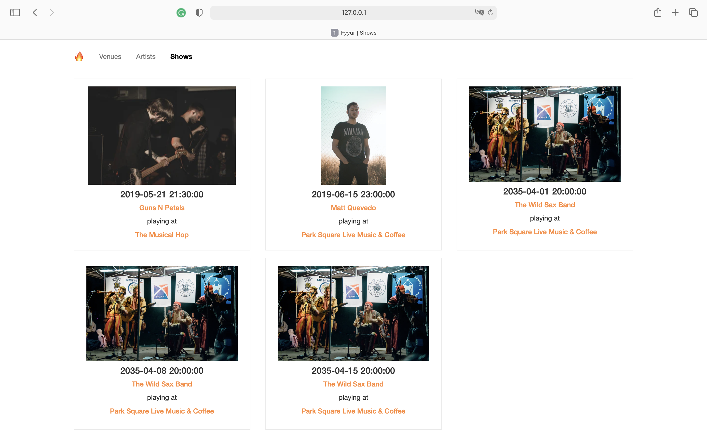

# Data Modeling for Music Event App

## Overview
Fyyur is a website that lists artists, venues, and shows and facilitates the discovery of live music events. I architected a PostgreSQL database to create, retrieve, update, and delete information about artists, venues and shows on Fyyur. I then built the data models to power the API endpoints for the Fyyur site.

## Tech Stack (Dependencies)
### 1. Backend Dependencies
 * **virtualenv** as a tool to create isolated Python environments
 * **SQLAlchemy ORM** as the ORM library 
 * **PostgreSQL** as the database 
 * **Python3** and **Flask** as the server language and server framework
 * **Flask-Migrate** for creating and running schema migrations
### 2. Frontend Dependencies
**HTML**, **CSS**, and **Javascript** with [Bootstrap 3](https://getbootstrap.com/docs/3.4/customize/) are used for the website's frontend. Bootstrap can only be installed by Node Package Manager (NPM). Therefore, if not already, download and install the [Node.js](https://nodejs.org/en/download/). Windows users must run the executable as an Administrator, and restart the computer after installation. After successfully installing the Node, verify the installation as shown below.

    ```
    node -v
    npm -v
    ```
Install [Bootstrap 3](https://getbootstrap.com/docs/3.3/getting-started/) for the website's frontend:

    ```
    npm init -y
    npm install bootstrap@3
    ```

## Getting Started
1. Set up database by running the queries of `schema.sql` and `seed.sql` in pgAdmin4, and verify the creation of the `artist`, `venue` and `show` tables. 


2. **Initialize and activate a virtualenv using:**
    ```
    python -m virtualenv env
    source env/bin/activate
    ```
    >**Note** - In Windows, the `env` does not have a `bin` directory. Therefore, you'd use the analogous command shown below:
    ```
    source env/Scripts/activate
    ```
3. **Install the dependencies:**
    ```
    pip install -r requirements.txt
    ```
4. **Run the development server:**
    ```
    cd web
    python application.py
    ```
4. **Verify on the Browser**<br>
Navigate to project homepage [http://127.0.0.1:5000/](http://127.0.0.1:5000/) or [http://localhost:5000](http://localhost:5000)

    
    
    
    
    
    
    
    
    
    
    
    
    
    
    

5. **Migration**
    ```
    flask db init
    flask db stamp head
    flask db migrate
    flask db upgrade
    ```